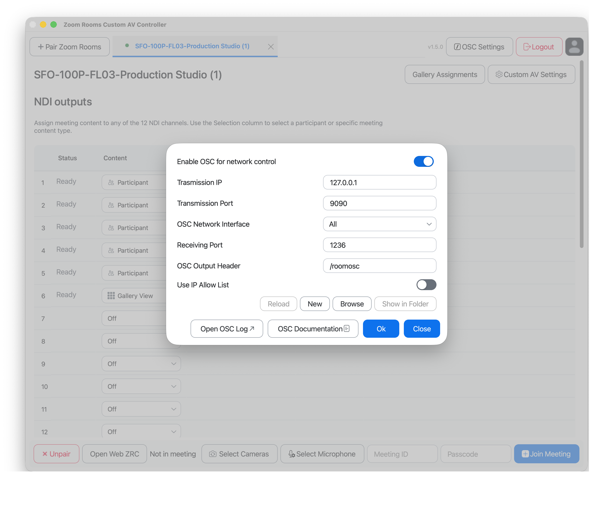
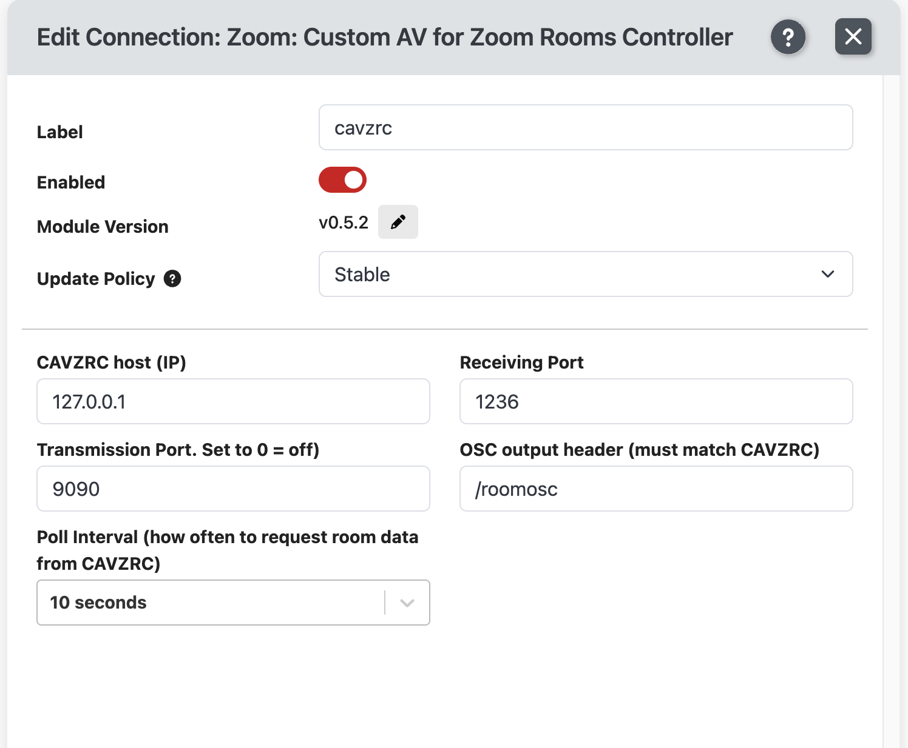
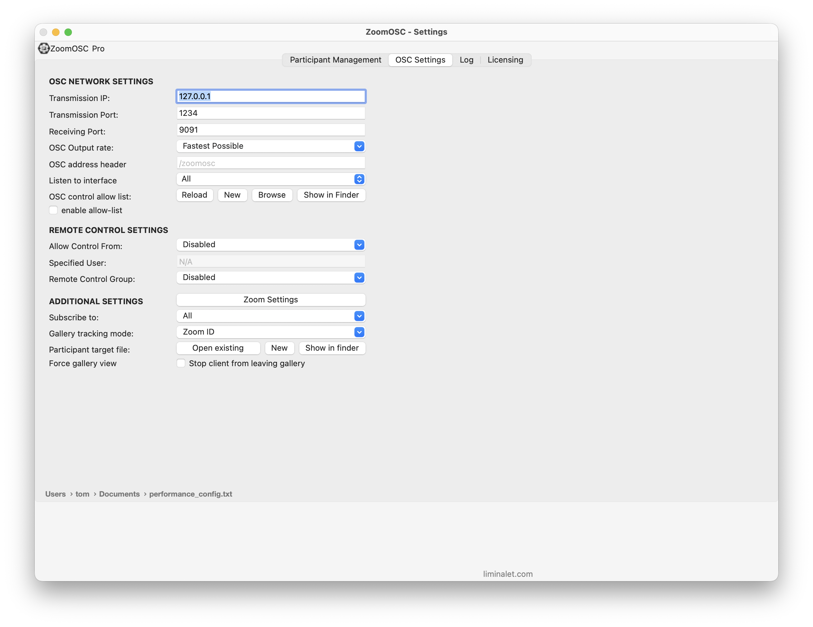
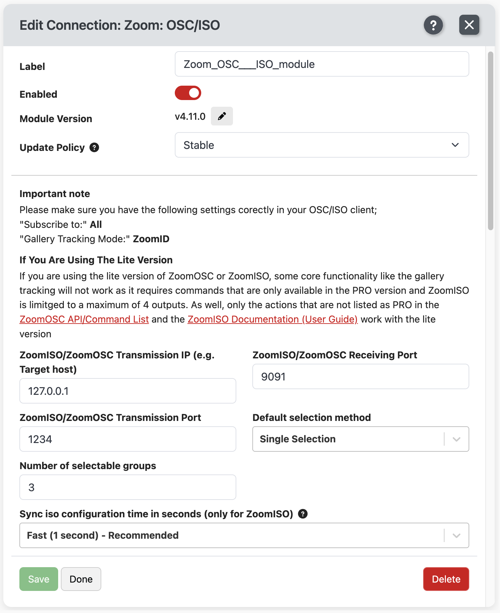
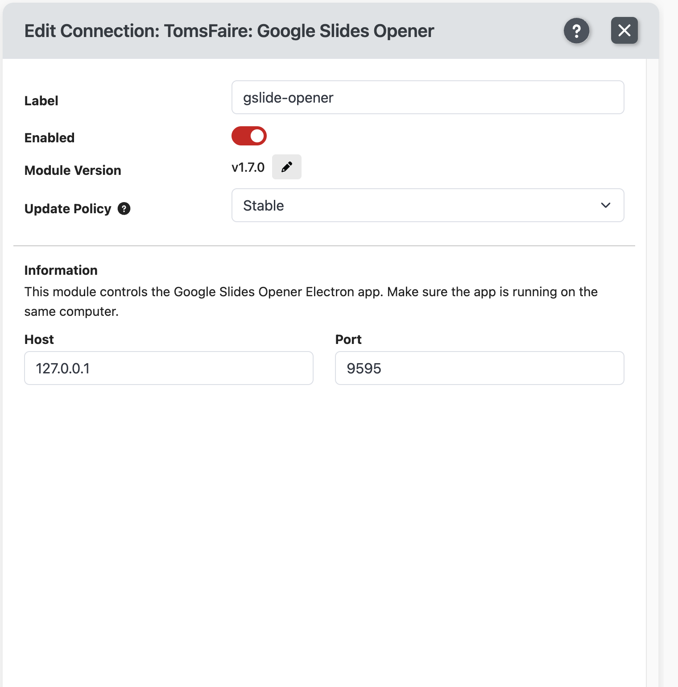

# 🎛️ London All Hands — Companion Setup & Test Config Guide

> Operational guide for setting up Bitfocus Companion and the London All Hands test configuration.

## Config baseline

- **Config file:** `LondonCompanion.companionconfig`
- **Companion build tested:** `4.3.4`
- **Companion pages:** `OP Controls` (Page 1) and `StageTimer London` (Page 2)

---

## Required Software

Install all of the following before loading the config.

| Software | Purpose | Link |
|---|---|---|
| Bitfocus Companion | Core controller app | https://bitfocus.io/companion |
| StageTimer.io | Session timer display | https://stagetimer.io |
| Google Slides Opener | Opens Google Slides + speaker notes locally | https://github.com/TomsFaire/Google-Slides-Controller |
| ZoomOSC | Zoom control via OSC (ISO edition) | [ZoomOSC — Zoom App Marketplace](https://marketplace.zoom.us/apps/VG_p3Bb_TwWe_bgZmPUaXw) |
| Zoom CavZRC | Zoom Room controller (second Zoom connection) | [Zoom Rooms Custom AV Controller — Zoom App Marketplace](https://marketplace.zoom.us/apps/hbAzPPSyQG-x7t4KVQQ4Sg) |

### Companion Modules Required

The Google Slides Opener module ships as a `.tgz` alongside the app release — **do not** install it from the Companion module store.

- `gslide-opener` v1.7.0+ — import the `.tgz` from the [Google-Slides-Controller release](https://github.com/TomsFaire/Google-Slides-Controller/releases/latest) via **Companion → Modules → Import module package**
- `stagetimerio-api` v2.5.0+
- `zoom-cavzrc` v0.5.2+
- `zoom-osc-iso` v4.11.0+

---

## Installation

> **This repo includes `setup.sh` — run it instead of the manual steps below.**
>
> ```bash
> bash setup.sh
> ```
>
> The script installs Homebrew and Companion, downloads and installs Google Slides Opener (correct arch, Gatekeeper cleared), opens the ZoomOSC Marketplace page, walks you through the Companion module and config import, then prompts for show variables and pushes them directly into Companion via its API. **Skip to [Sign into each service](#2-sign-into-each-service) once the script finishes.**

### 1. Install and launch local apps (manual path)

1. Download and install **Bitfocus Companion** from the link above.
2. Install **ZoomOSC ISO** from the Zoom App Marketplace link above.
3. Install **Zoom Rooms Custom AV Controller / CAVZRC** from the Zoom App Marketplace link above.
4. Download **Google Slides Opener** from the [latest release](https://github.com/TomsFaire/Google-Slides-Controller/releases/latest) (pick `arm64-mac.zip` or `x64-mac.zip`). Also download `companion-module-gslide-opener.tgz` from the same release.
   - Drag **Google Slides Opener.app** into `/Applications`
   - If macOS Gatekeeper blocks it: right-click → Open → Open, or run: `xattr -dr com.apple.quarantine "/Applications/Google Slides Opener.app"`
5. In Companion → **Modules → Import module package** → select `companion-module-gslide-opener.tgz`
6. Open Companion → **Settings → Import/Restore** → select `LondonCompanion.companionconfig` → **Full restore**
7. Launch **ZoomOSC ISO**, **CAVZRC**, and **Google Slides Opener** before opening or validating Companion.

### 2. Sign into each service

All local control apps must be authenticated before the Companion config will work reliably.

| App | Login requirement | Validation |
|---|---|---|
| ZoomOSC ISO | Sign into the Zoom account authorized to control the meeting | App is signed in and can join / control the target meeting |
| Zoom Rooms Custom AV Controller / CAVZRC | Sign into the Zoom account with access to the London Zoom Room | App shows the intended Zoom Room and can connect to it |
| Google Slides Opener | Sign into the Google account that has access to the show deck | The `Slides` URL opens and speaker notes can launch locally |
| StageTimer.io | Sign into the StageTimer account / room used for the event | Room `E5KJ2Y79 - London` loads and timers/messages are editable |

### 3. Confirm app and Companion settings

After importing, verify the app-side settings match the Companion connection values below. These are the baseline for the London test config.

> If any app runs on a different machine, replace `127.0.0.1` in Companion with that machine's IP and revalidate the network path / firewall rules.

#### CAVZRC / Zoom Rooms Custom AV Controller

| Area | Setting | Value |
|---|---|---|
| CAVZRC app | Enable OSC for network control | On |
| CAVZRC app | Transmission IP | `127.0.0.1` |
| CAVZRC app | Transmission Port | `9090` |
| CAVZRC app | Receiving Port | `1236` |
| CAVZRC app | OSC Output Header | `/roomosc` |
| CAVZRC app | OSC Network Interface / IP Allow List | `All` / Off |
| Companion connection | Label / module | `cavzrc` / `v0.5.2` |
| Companion connection | Host / ports / header | `127.0.0.1`, RX `1236`, TX `9090`, `/roomosc` |
| Companion connection | Poll Interval | `10 seconds` |




#### ZoomOSC / ZoomISO

| Area | Setting | Value |
|---|---|---|
| ZoomOSC app | Transmission IP / Port | `127.0.0.1` / `1234` |
| ZoomOSC app | Receiving Port | `9091` |
| ZoomOSC app | Output rate / interface | `Fastest Possible` / `All` |
| ZoomOSC app | Subscribe to / Gallery Tracking Mode | `All` / `Zoom ID` |
| Companion connection | Label / module | `Zoom_OSC___ISO_module` / `v4.11.0` |
| Companion connection | Host / ports | `127.0.0.1`, RX `9091`, TX `1234` |
| Companion connection | Selection / groups / sync | `Single Selection`, `3`, `Fast (1 second) - Recommended` |




#### Google Slides Opener

| Area | Setting | Value |
|---|---|---|
| Companion connection | Label / module | `gslide-opener` / `v1.7.0` |
| Companion connection | Host / Port | `127.0.0.1` / `9595` |
| Local app | Required state | Google Slides Opener is running on the same computer and logged into the Google account with deck access |



### 4. First validation after import

- Confirm **Google Slides Opener** can launch the deck from the `Slides` variable.
- Confirm **ZoomOSC ISO** can join/control the meeting using the configured meeting ID and passcode.
- Confirm **CAVZRC** can see/control the intended London Zoom Room.
- Confirm **StageTimer.io** room `E5KJ2Y79 - London` loads and the Companion StageTimer buttons update timer state.

---

## Pre-Show Configuration

Before the show, update these custom variables in Companion under **Custom Variables**. The `setup.sh` script handles this interactively — skip this section if you used the script.

### Required — Must Set Every Show

| Variable | Description | Example |
|---|---|---|
| `meetingID` | Zoom meeting ID | `123 456 7890` |
| `meetingPasscode` | Zoom meeting passcode | `abc123` |
| `Slides` | Full URL of the Google Slides presentation | `https://docs.google.com/presentation/d/...` |
| `Speaker0` | Display name of the **in-room London Zoom instance** | `London AH Room` |

### Speaker Spotlighting

Set these to the Zoom **display names** of remote speakers who will be spotlighted during the show. Leave blank if not used.

| Variable | Description |
|---|---|
| `Speaker1` | Remote speaker 2 |
| `Speaker2` | Remote speaker 3 |
| `Speaker3` | Remote speaker 4 |

### Timer Labels

`Timer1` through `Timer10` are cached label values from the last time the config was used. Treat them as stale on import.

When the StageTimer operator presses a timer button, Companion updates that button label from the active StageTimer session name. Do **not** use the imported `Timer1`–`Timer10` values as the source of truth for the run of show.

---

## Connection Settings

These are pre-configured in the import. Verify if connection errors appear.

| Module | Host | Ports |
|---|---|---|
| StageTimer API | api.stagetimer.io | Room ID: `E5KJ2Y79` |
| Google Slides Opener | 127.0.0.1 | Port `9595` |
| Zoom CavZRC | 127.0.0.1 | TX `1236` / RX `9090` |
| ZoomOSC ISO | 127.0.0.1 | TX `9091` / RX `1234` |

> ZoomOSC and Companion must be on the **same machine**. If running on separate machines, update the host IP accordingly.

---

## Page 1 — OP Controls

**Operator:** Primary / show operator
This page controls slides, Zoom meeting, and speaker spotlighting.

### Button Layout

```
Row 0: [Launch Slides] [Launch Notes] [           ] [           ] [           ] [           ] [Toggle Screen Share] [Join Meeting]
Row 1: [Reload Slides] [Show QR Code] [           ] [           ] [           ] [           ] [                   ] [            ]
Row 2: [Notes –      ] [Notes ↑     ] [Notes +    ] [           ] [           ] [           ] [Spotlight London   ] [Spotlight Remote Speaker1]
Row 3: [<< Slide     ] [↓ Notes     ] [>> Slide   ] [           ] [           ] [           ] [Spotlight Speaker2 ] [Spotlight Speaker3]
```

### Button Reference

#### Launch Slides
- **Press once** — Opens the Google Slides presentation from the `Slides` variable in Google Slides Opener with speaker notes.
- **Press again** — Closes the presentation.
- **Color indicator:** Dark = slides closed · Orange = slides open / ready to close.

#### Launch Notes
- **Press once** — Opens the speaker notes window separately.
- **Press again** — Closes speaker notes.
- **Color indicator:** Dark/green = notes closed · Orange-red = notes open.

#### Reload Slides
- **Hold 1 second** — Reloads the presentation. Use this if slides update mid-show.
- **Color indicator:** Yellow-orange = slides not open · Red = slides open and reload is live.

#### Show QR Code
- **Press** — Displays the StageTimer audience-facing QR code for **20 seconds**, then hides automatically.

#### Toggle Screen Share
- **Press** — Starts Zoom screen share on the Slides Zoom instance. Press again to stop.

#### Join Meeting
- **Press** — Both Zoom instances (London room + Slides) join the meeting simultaneously using `meetingID` and `meetingPasscode`.
- The London room joins as **"London"** and the slides instance joins as **"Slides"**.

### Slide Navigation

| Button | Action |
|---|---|
| `<< Slide` | Previous slide |
| `>> Slide` | Next slide |

### Speaker Notes Navigation

| Button | Action |
|---|---|
| `Notes ↑` | Scroll notes up |
| `↓ Notes` | Scroll notes down |
| `Notes –` | Zoom out notes text |
| `Notes +` | Zoom in notes text |

### Spotlighting

Spotlights a participant in Zoom so they appear full-screen for attendees. Button lights up when that person is currently spotlighted.

| Button | Spotlights |
|---|---|
| Spotlight London | `Speaker0` — the in-room London Zoom instance |
| Spotlight Remote | `Speaker1` |
| Spotlight (row 3, col 6) | `Speaker2` |
| Spotlight (row 3, col 7) | `Speaker3` |

> **Tip:** Spotlight buttons are named dynamically from the Speaker variables. Update those variables before the show so the buttons display the correct names.

---

## Page 2 — StageTimer London

**Operator:** StageTimer operator / second operator
This page controls session timers, displays timer status, and sends timing messages to the audience display.

### Button Layout

```
Row 0: [Start/Stop] [Timer Info    ] [Mins Left] [Secs Left] [Clear MSG] [         ] [         ] [         ]
Row 1: [Timer 1  ] [Timer 2       ] [Timer 3  ] [Timer 4  ] [Timer 5  ] [Timer 6  ] [         ] [         ]
Row 2: [Timer 7  ] [Timer 8       ] [Timer 9  ] [Timer 10 ] [         ] [+30s     ] [         ] [         ]
Row 3: [         ] [MSG 1 · 5 MIN ] [MSG 2 · 2 MIN] [MSG 3 · 30 SEC] [MSG 4] [-30s] [         ] [         ]
```

### Row 0 — Timer Status & Controls

#### Start/Stop
- **Press** — Starts or stops the currently active timer.
- **Color:** Green = timer stopped · Red = timer running.

#### Timer Info Display *(display only)*
Shows the active timer's **name**, **speaker**, and **total duration**.

Color codes:
- **Green** = running on time
- **Yellow** = yellow warning phase (set in StageTimer)
- **Orange-red** = red warning phase
- **Dark red** = overtime
- **Dark green** = stopped / paused

#### Remaining Minutes / Remaining Seconds *(display only)*
Live countdown. Same color coding as Timer Info.

#### Clear MSG
- **Press** — Hides any active StageTimer message from the audience display.
- **Lights red** when a message is currently showing.

### Rows 1–2 — Session Timers (Timers 1–10)

Each timer button does three things when pressed:
1. **Resets** the corresponding StageTimer slot back to full duration.
2. Waits 1 second so the reset can complete.
3. **Starts** the timer immediately.
4. **Updates** the button label with the current timer's name from StageTimer.

Timer-to-StageTimer slot mapping:

| Button | StageTimer Slot |
|---|---|
| Timer 1 | Slot 2 |
| Timer 2 | Slot 3 |
| Timer 3 | Slot 4 |
| Timer 4 | Slot 5 |
| Timer 5 | Slot 6 |
| Timer 6 | Slot 7 |
| Timer 7 | Slot 8 |
| Timer 8 | Slot 9 |
| Timer 9 | Slot 10 |
| Timer 10 | Slot 11 |

> **Note:** Slot 1 in StageTimer is reserved. Timers start from slot 2.

### +30s / –30s

Adds or subtracts 30 seconds from the **currently running** timer. Use for live adjustments without stopping the clock.

### Row 3 — Timed Messages

Sends a pre-written message to the StageTimer audience display. Messages are configured in StageTimer.io directly.

| Button | Message Slot | Intended Use |
|---|---|---|
| MSG 1 | Message 1 | 5-minute warning |
| MSG 2 | Message 2 | 2-minute warning |
| MSG 3 | Message 3 | 30-second warning |
| MSG 4 | Message 4 | Custom / ad-hoc |

- **Press** to show/hide the message.
- Use **Clear MSG** (row 0) to hide all messages quickly.

---

## StageTimer Setup Notes

- Room ID is pre-configured: **E5KJ2Y79 - London**
- Log into [stagetimer.io](https://stagetimer.io) to set timer durations, session names, and message text before the show.
- The Companion config pulls **session names dynamically** — timer button labels update automatically when a timer is activated.

---

## Troubleshooting

| Problem | Fix |
|---|---|
| Slides won't open | Check Google Slides Opener is running and the `Slides` variable is a valid Google Slides URL |
| Zoom buttons unresponsive | Verify ZoomOSC ISO is running and both Zoom instances are open |
| Timer display shows no data | Check StageTimer connection in Companion → Connections and verify Room ID |
| Spotlight does nothing | Confirm the Speaker variable exactly matches the Zoom display name (case-sensitive) |
| Stream Deck not responding | Reconnect the device; Companion should redetect it automatically |
